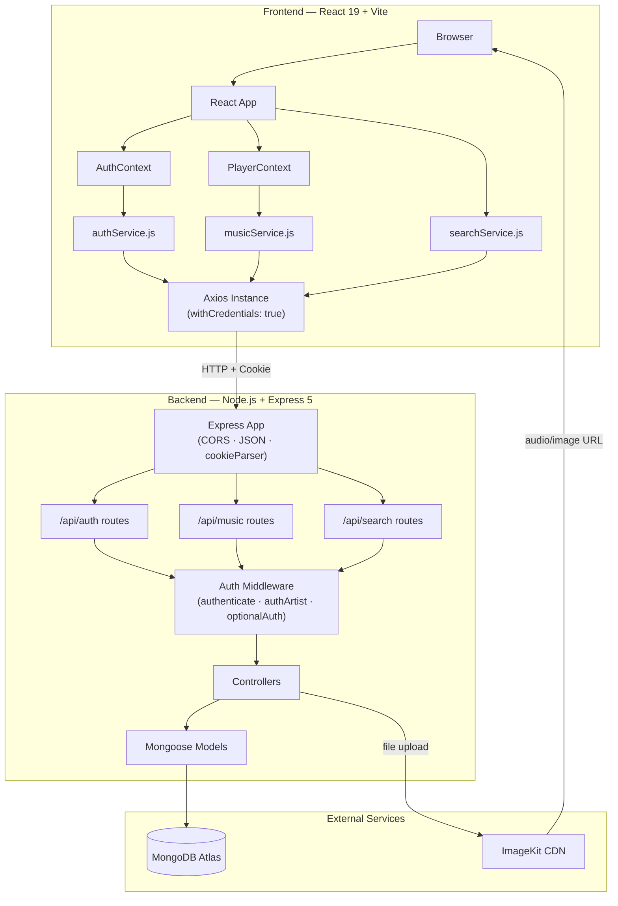
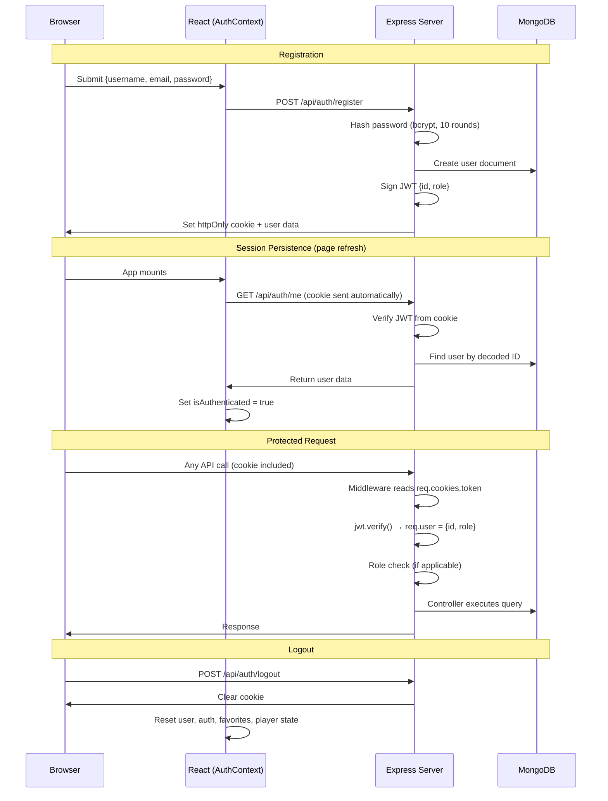
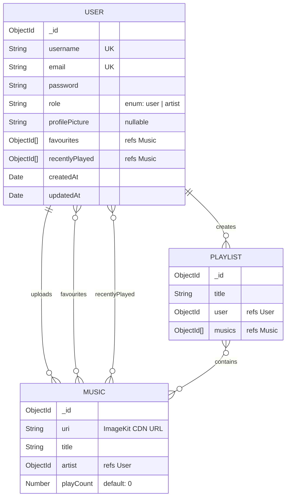

# SonicStream

A full-stack music streaming platform built with React.js, Node.js, Express.js, and MongoDB. SonicStream enables users to discover, play, and organize music while providing artists with a dedicated dashboard to upload and manage their content — all powered by secure cookie-based JWT authentication and ImageKit cloud storage.

The platform serves two distinct user roles: **listeners** who can browse music, search, build playlists, and save favorites, and **artists** who can upload songs, create albums, and track their content through a dedicated dashboard. Guest browsing is also supported for unauthenticated visitors.

---

## Features

### Authentication & Security
- User registration with bcrypt password hashing (10 salt rounds)
- Login via email or username with JWT-based session management
- Secure httpOnly cookie storage — tokens are never exposed to client-side JavaScript
- Session persistence across page refreshes via automatic token verification
- Role-based access control (`user` and `artist` roles)
- Three-tier middleware system: `authenticate`, `authArtist`, `optionalAuthenticate`
- Frontend route guards: `ProtectedRoute`, `ArtistRoute`, `EntryRoute`
- Resource-level ownership checks on update/delete operations

### Music
- Browse all songs sorted by newest first
- View trending songs ranked by play count (top 5)
- Play songs directly from ImageKit CDN via the HTML5 Audio API
- Queue-based playback with next/previous, seek, volume, and mute controls
- Persistent player bar (Footer) visible across all pages

### Search
- Global search across songs, playlists, and artists simultaneously
- Case-insensitive regex matching with 500ms debounce
- Results categorized into Songs, Albums & Playlists, and Artists sections

### Favorites
- Like/unlike songs with a single click (heart icon)
- Dedicated Favorites page displaying all liked songs
- Instant UI feedback — favorites update without page reload
- Accessible from both song cards and the player bar

### Playlists
- Create, edit, and delete personal playlists
- Select songs from the full music library when building playlists
- View any playlist's full track listing with deep-populated artist data
- Ownership-protected — users can only modify their own playlists

### Artist Dashboard
- **Stats overview**: total songs, total playlists/albums, recently uploaded songs
- **Song management**: view, edit titles, and delete uploaded songs
- **Album/playlist management**: full CRUD with song selection
- **Upload**: upload audio files with title via the dashboard
- Protected by both frontend (`ArtistRoute`) and backend (`authArtist`) guards

### Profile & Settings
- Profile page displaying avatar, username, email, role, and join date
- Update username and email with duplicate-checking
- Upload and change profile picture (stored on ImageKit)
- Change password with current-password verification
- Tabbed settings interface (Profile / Password)

### Playback Tracking
- Play count incremented on each song play
- Recently played history maintained per user (most recent first, no duplicates)
- Trending endpoint surfaces the most-played songs

---

## Tech Stack

| Technology | Purpose |
|---|---|
| **React 19** | Frontend UI library |
| **Vite 8** | Frontend build tool and dev server |
| **Tailwind CSS 4** | Utility-first styling with custom design tokens |
| **React Router 7** | Client-side routing with nested layouts |
| **React Context API** | Global state management (Auth + Player) |
| **Axios** | HTTP client with cookie credentials |
| **Node.js** | Server-side JavaScript runtime |
| **Express 5** | Backend web framework and REST API |
| **MongoDB Atlas** | Cloud-hosted document database |
| **Mongoose 9** | ODM — schema validation, references, populate |
| **JSON Web Tokens** | Stateless authentication |
| **bcryptjs** | Password hashing with salt |
| **cookie-parser** | HTTP cookie parsing middleware |
| **ImageKit** | Cloud storage and CDN for audio files and images |
| **Multer** | Multipart file upload handling (memory storage) |
| **react-icons** | Icon set (Feather icons) for auth and profile UI |
| **lucide-react** | Icon set for dashboard and playlist UI |

---

## Architecture



**Key architectural decisions:**

- **Decoupled SPA** — frontend and backend run independently on separate ports
- **Cookie-based JWT** — httpOnly cookies prevent XSS token theft; browser sends cookies automatically
- **Cloud file storage** — audio files and images are stored on ImageKit CDN, not in the database or on the server
- **React Context over Redux** — lightweight state management sufficient for two global concerns (auth + player)
- **Three-tier auth middleware** — `optionalAuthenticate` enables guest browsing, `authenticate` requires login, `authArtist` restricts to artists

---

## Project Structure

```
Sonic-Stream/
├── Backend/
│   ├── server.js                     # Entry point — starts server, connects DB
│   ├── package.json                  # Backend dependencies
│   └── src/
│       ├── app.js                    # Express config (CORS, middleware, route mounting)
│       ├── controllers/
│       │   ├── auth.controller.js    # Auth, favorites, profile, password logic
│       │   ├── music.controller.js   # Music/playlist CRUD, playback, trending, stats
│       │   └── search.controller.js  # Global search across collections
│       ├── db/
│       │   └── db.js                 # Mongoose connection
│       ├── middlewares/
│       │   ├── auth.middleware.js     # JWT verification + role-based guards
│       │   └── multer.middleware.js   # File upload (memory storage)
│       ├── models/
│       │   ├── user.model.js         # User schema
│       │   ├── music.model.js        # Music schema
│       │   └── playlist.model.js     # Playlist schema
│       ├── routes/
│       │   ├── auth.routes.js        # /api/auth endpoints
│       │   ├── music.routes.js       # /api/music endpoints
│       │   └── search.routes.js      # /api/search endpoints
│       └── services/
│           └── storage.service.js    # ImageKit upload wrapper
│
├── Frontend/
│   ├── index.html                    # HTML shell (Google Fonts: Inter)
│   ├── vite.config.js                # Vite + React + Tailwind CSS v4
│   ├── package.json                  # Frontend dependencies
│   └── src/
│       ├── main.jsx                  # React DOM entry point
│       ├── App.jsx                   # Providers + Router setup
│       ├── index.css                 # Tailwind @theme tokens + custom scrollbar
│       ├── context/                  # AuthContext, PlayerContext
│       ├── hooks/                    # useAuth, usePlayer
│       ├── services/                 # api.js, authService, musicService, searchService
│       ├── routes/                   # AppRoutes (all route definitions)
│       ├── layout/                   # MainLayout, AuthLayout
│       ├── components/
│       │   ├── auth/                 # ProtectedRoute, EntryRoute, ArtistRoute, AuthPrompt
│       │   ├── common/               # Button, EmptyState, ErrorMessage, Loader
│       │   ├── dashboard/            # MusicForm, PlaylistForm
│       │   ├── layout/               # Navbar, Sidebar, Footer (player bar)
│       │   └── music/                # SongCard, AlbumCard, ArtistCard, SearchBar
│       ├── pages/                    # 14 page directories (Home, Login, Dashboard, etc.)
│       ├── constants/                # Route paths, API endpoints
│       └── utils/                    # formatDate, formatDuration
```

---

## Authentication

SonicStream uses **cookie-based JWT authentication** with the following flow:



**Key implementation details:**

| Aspect | Implementation |
|---|---|
| Password hashing | `bcryptjs` with 10 salt rounds |
| JWT payload | `{ id: user._id, role: user.role }` |
| Token storage | httpOnly cookie named `"token"` |
| Cookie flags | `httpOnly: true`, `sameSite: "lax"` |
| Session restore | `GET /api/auth/me` called on app mount via `useEffect` |
| Password excluded | `.select("-password")` on user queries |
| Logout | `res.clearCookie("token")` server-side + full state reset client-side |

**Authorization levels:**

| Middleware | Access |
|---|---|
| `optionalAuthenticate` | Everyone (identifies user if logged in) |
| `authenticate` | Logged-in users and artists |
| `authArtist` | Artists only (`role === "artist"`) |

Controllers additionally perform **ownership verification** — users can only edit/delete their own songs and playlists.

---

## Database Design



**Mongoose features used:** `populate` (including nested/deep population), `$addToSet`, `$pull`, `$push` with `$position`, `$inc`, `$or`, `$regex`, `countDocuments`, `Promise.all` for parallel queries.

---

## API Overview

### Auth — `/api/auth`

| Method | Endpoint | Auth | Purpose |
|---|---|---|---|
| POST | `/register` | — | Create account |
| POST | `/login` | — | Authenticate |
| POST | `/logout` | — | Clear session |
| GET | `/me` | Required | Get current user |
| POST | `/like` | Required | Add to favorites |
| POST | `/unlike` | Required | Remove from favorites |
| GET | `/favourites` | Required | Get liked songs |
| PUT | `/profile` | Required | Update profile (+ image upload) |
| PUT | `/password` | Required | Change password |

### Music — `/api/music`

| Method | Endpoint | Auth | Purpose |
|---|---|---|---|
| GET | `/` | Optional | All songs (newest first) |
| GET | `/trending` | Optional | Top 5 by play count |
| GET | `/playlists` | Optional | All playlists |
| GET | `/playlists/:id` | Optional | Playlist detail (deep populated) |
| GET | `/artists/:id` | Optional | Artist profile + songs + albums |
| GET | `/artist/stats` | Artist | Dashboard stats |
| POST | `/:id/play` | Required | Track playback |
| POST | `/upload` | Artist | Upload song (+ file) |
| POST | `/playlist` | Required | Create playlist |
| PUT | `/:id` | Artist | Update song title |
| DELETE | `/:id` | Artist | Delete song (cascades to playlists) |
| PUT | `/playlists/:id` | Required | Update playlist |
| DELETE | `/playlists/:id` | Required | Delete playlist |

### Search — `/api/search`

| Method | Endpoint | Auth | Purpose |
|---|---|---|---|
| GET | `/?q=<query>` | Optional | Search songs, playlists, and artists |

---

## Music Upload & Streaming Flow

```
UPLOAD (Artist → ImageKit → MongoDB)
─────────────────────────────────────
1. Artist selects audio file + enters title in the dashboard
2. Frontend sends FormData to POST /api/music/upload
3. authArtist middleware verifies JWT role
4. Multer stores file in memory (req.file.buffer)
5. Buffer is converted to base64 string
6. ImageKit SDK uploads base64 to CDN → returns URL
7. Music document created in MongoDB with { uri: imageKitUrl, title, artist }

PLAYBACK (MongoDB → ImageKit CDN → Browser)
────────────────────────────────────────────
1. Frontend fetches song list (includes ImageKit URI per song)
2. User clicks a song → PlayerContext.playSong(song, queue)
3. Context sets audioRef.current.src = song.uri (ImageKit CDN URL)
4. HTML5 Audio element streams directly from CDN
5. POST /api/music/:id/play increments playCount and updates recentlyPlayed
6. Footer player bar displays controls, progress, and volume
```

Audio is served directly via ImageKit CDN URLs — the backend does **not** proxy or re-stream audio content.

---

## Frontend Architecture

**Provider hierarchy:** `BrowserRouter` → `AuthProvider` → `PlayerProvider` → `AppRoutes`

**Routing structure (React Router 7):**

| Route | Page | Guard |
|---|---|---|
| `/welcome` | Welcome | — (AuthLayout) |
| `/login` | Login | — (AuthLayout) |
| `/register` | Register | — (AuthLayout) |
| `/` | Home | EntryRoute |
| `/search` | Search | EntryRoute |
| `/album/:albumId` | Album | EntryRoute |
| `/artist/:artistId` | Artist | EntryRoute |
| `/favorites` | Favorites | ProtectedRoute |
| `/profile` | Profile | ProtectedRoute |
| `/settings` | Settings | ProtectedRoute |
| `/my-playlists` | MyPlaylists | ProtectedRoute |
| `/dashboard/*` | Dashboard (4 sub-pages) | ArtistRoute |

**State management:**

- **AuthContext** — `user`, `isAuthenticated`, `isGuest`, `loading`, `favorites`, and methods: `login`, `register`, `logout`, `toggleFavorite`, `continueAsGuest`, `updateUser`
- **PlayerContext** — `currentSong`, `queue`, `isPlaying`, `currentTime`, `duration`, `volume`, `isMuted`, and methods: `playSong`, `togglePlay`, `playNext`, `playPrevious`, `seek`, `setVolume`, `toggleMute`

**API communication:** All API calls go through a centralized Axios instance (`services/api.js`) configured with `baseURL: "http://localhost:3000"` and `withCredentials: true` to include cookies.

---

## Installation

### Prerequisites
- Node.js (v18+)
- MongoDB Atlas account (or local MongoDB instance)
- ImageKit account

### Backend Setup

```bash
cd Backend
npm install
```

Create a `.env` file in the `Backend/` directory (see [Environment Variables](#environment-variables)).

```bash
npm run dev      # Development (nodemon)
npm start        # Production
```

The backend runs on **http://localhost:3000**.

### Frontend Setup

```bash
cd Frontend
npm install
npm run dev
```

The frontend runs on **http://localhost:5173**.

---

## Environment Variables

Create a `Backend/.env` file with the following variables:

| Variable | Description |
|---|---|
| `MONGO_URI` | MongoDB connection string |
| `JWT_SECRET` | Secret key for signing JWTs |
| `IMAGEKIT_PUBLIC_KEY` | ImageKit public API key |
| `IMAGEKIT_PRIVATE_KEY` | ImageKit private API key |
| `IMAGEKIT_URL_ENDPOINT` | ImageKit URL endpoint (e.g. `https://ik.imagekit.io/your_id/`) |

> **Never commit `.env` files to version control.** Use a `.env.example` file with placeholder values instead.

---

## API & Feature Usage

### Registering and Logging In
New users register with a username, email, and password. Upon registration, a JWT is issued and stored as an httpOnly cookie. Login accepts email + password. Session persists across page refreshes via an automatic `/api/auth/me` check on app mount.

### Browsing Music (Including Guests)
The home page displays **Trending** songs (top 5 by play count), **Recently Added** songs (newest first), and **Popular Playlists**. Guests can also browse via the search page and view album/artist detail pages — these routes use `optionalAuthenticate` on the backend.

### Playing Music
Clicking a song triggers playback via the HTML5 Audio API. The player bar (Footer) displays song info, play/pause, next/previous, a draggable seek bar, volume control, and a favorite toggle. Songs auto-advance when a queue is active.

### Managing Favorites
Authenticated users can like/unlike songs from song cards or the player bar. The Favorites page displays all liked songs. Favorites state is managed in AuthContext for instant UI updates.

### Creating Playlists
Users create playlists from the "My Playlists" page (for regular users) or the Dashboard (for artists). The playlist form fetches all available songs and allows multi-select. Playlists can be edited and deleted.

### Artist Dashboard
Artists access a dedicated dashboard with four sections: overview stats, uploaded songs management, playlist/album management, and a song upload form. The upload form accepts an audio file and title, uploading to ImageKit via the backend.

### Updating Profile
The Settings page offers two tabs: **Profile** (update username, email, avatar) and **Password** (change with current-password verification). Profile pictures are uploaded to ImageKit via multer + FormData.

---

## Security Considerations

| Mechanism | Implementation |
|---|---|
| Password storage | Bcrypt hashed with 10 salt rounds — plaintext passwords are never stored |
| Token security | JWT stored in httpOnly cookie (inaccessible to JavaScript / XSS attacks) |
| CSRF mitigation | `sameSite: "lax"` on cookies |
| Password exclusion | `-password` select on all user queries that return data |
| CORS | Restricted to `http://localhost:5173` with `credentials: true` |
| Ownership checks | Controllers verify `resource.owner === req.user.id` before mutations |
| Role enforcement | Backend middleware rejects unauthorized roles with 401/403 |
| Input guards | File existence checks, query parameter validation, duplicate-user checks |

---

## Future Improvements

These are enhancements **not currently implemented** that would strengthen the application:

- **JWT expiration and refresh tokens** — current tokens have no expiry
- **Cookie `secure` flag** — required for HTTPS in production
- **Server-side role assignment** — prevent clients from setting their own role during registration
- **Input validation library** — add Joi or express-validator for request body/params validation
- **Rate limiting** — protect login and upload endpoints from abuse
- **File type and size limits** — enforce audio-only uploads and maximum file sizes in multer
- **MongoDB text indexes** — replace `$regex` search with indexed full-text search
- **Pagination** — add `skip`/`limit` to music and playlist listing endpoints
- **Cover images for songs** — add a `coverImage` field to the Music model
- **Timestamps on Music/Playlist** — enable `{ timestamps: true }` for creation/update tracking
- **Global error handling middleware** — catch unhandled errors in Express
- **Automated tests** — add unit and integration tests with Jest or Vitest
- **Popular artists endpoint** — implement a dedicated `/api/artists/popular` route

---

## Learning & Interview Highlights

SonicStream demonstrates the following engineering concepts:

| Concept | Where It's Applied |
|---|---|
| **Authentication vs Authorization** | `authenticate` verifies identity; `authArtist` checks permissions |
| **Password hashing with salt** | Bcrypt (10 rounds) — one-way hash, timing-safe comparison |
| **Stateless JWT authentication** | Payload `{id, role}`, verified on each request, no session store |
| **httpOnly cookie security** | Tokens invisible to client-side JS, preventing XSS theft |
| **Role-based access control** | Three middleware tiers enforce user/artist/guest access |
| **RESTful API design** | Resource-oriented URLs, proper HTTP methods, status codes |
| **Express middleware pattern** | Request pipeline: CORS → JSON → cookies → auth → controller |
| **MongoDB document references** | `ObjectId` refs with `.populate()` for relational-style queries |
| **Atomic MongoDB operators** | `$addToSet`, `$pull`, `$inc`, `$push` with `$position` |
| **React Context for global state** | Two contexts replace Redux for auth state and player state |
| **Custom hooks** | `useAuth()` and `usePlayer()` abstract context consumption |
| **HTML5 Audio API** | `useRef(new Audio())` for imperative playback control |
| **Queue data structure** | Song queue with index-based next/previous navigation |
| **File upload pipeline** | Client FormData → multer memory → base64 → ImageKit CDN |
| **Search debouncing** | 500ms delay reduces unnecessary API calls while typing |
| **Parallel async operations** | `Promise.all` for concurrent DB queries (search, home data) |
| **Frontend route protection** | Three guard components mirror the three backend middlewares |
| **Ownership-based authorization** | Resource-level checks prevent unauthorized modifications |

---

*Built with React.js · Node.js · Express.js · MongoDB · ImageKit*
